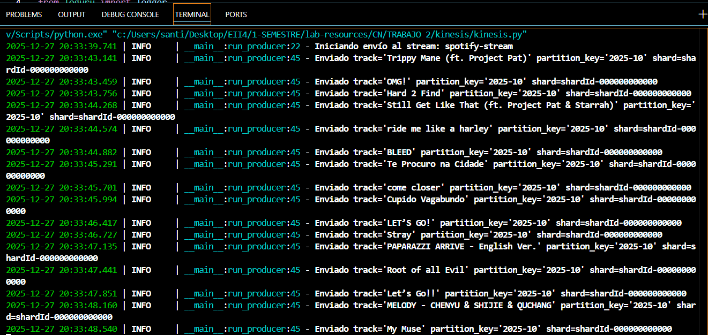

---
CN: Trabajo 2 - kinesis, firehose, Glue, athena  
---
```bash
uv init
uv venv # si no se creo
uv add boto3
uv add loguru 
```
> cuando llegue al "10.", ejecutar con "run" para usar el venv de generado por uv. 


# Base: [Spotify Dataset](https://www.kaggle.com/datasets/wardabilal/spotify-global-music-dataset-20092025)

1. Descargar el dataset de kaggle (ya esta aqui)
2. En la carpeta del proyecto se incluye el zip "[archive](archive.zip)" y se descomprime.
3. El archivo a tratar es [spotify data clean](./archive/spotify_data%20clean.csv)
4. Se ejecuta [csv to json](./data/music_csv_to_json_10000_entries.py) para transformarlo en formato Json limitando a 10000 entradas.
5. El resultado se almacena en la ruta indicada en dicho script, guardandose en [raw](./data/spotify-global-music-dataset-10000.json)
> Resultaron haber 8582 filas
6. se procesan los datos de [raw](./data/spotify-global-music-dataset-10000.json) nuevamente, la idea es buscar un partition key, usando [analyze_partition_keys](./data/partiton_key.py), la salida se guarda en [output](./data/partition_key_output.txt), como se puede ver, los artistas usan caracteres especiales en su nombre, mientras que usando solo el año se acumulan bastantes entradas solo en 2025, por lo que la clave final sera año-mes

# kinesis

7. Ejecutar el script [kinesis bash](./kinesis/kinesis.sh) para crear los recursos aws necesarios



# firehose

> Teniendo en cuenta la clave de particion para el stream (yyyy-MM), para los datos sin procesar se puede usar esa misma clave, por lo que se generan dos claves de particion en la [firehose lambda](./firehose/firehose.py), dicha lambda esta comprimida en zip en la raiz de este proyecto y usada en el [firehose bash](./firehose/firehose.bash)
9. Ejecutar el script [firehose bash](./firehose/firehose.bash) para conectar los datos del stream a S3 con firehose, resultando en algo como 

```
s3://datalake-spotify-.../
|> raw/
    |> spotify-by-album-release-date/
        |> 2019/
        │   |> 01/
        │   |> 02/
        │   |> ...
        |> 2020/
        │   |> 01/
        │   |> ...

```
10. Ejecutar el script [kinesis python](./kinesis/kinesis.py) para producir los datos y transmitirlos por kinesis data stream para que firhose los capture.
> las entradas quedan con sus datos filtrados, los que considero necesarios:
```py
payload = {
            "track_id": track["track_id"],
            "track_name": track["track_name"],
            "artist": track["artist_name"],
            "album": track["album_name"],
            "album_id": track["album_id"],
            "duration_min": float(track["track_duration_min"]),
            "genres": track["artist_genres"].split(",") if track["artist_genres"] else [],
            "album_release_date": track["album_release_date"]
        }
```
> este proceso tarda alrededor de 1 hora
# glue
> ver [dayly](./glue/daily_longest_songs.py) y [monthly](./glue/monthly_duration_time_aggregation.py)
11. se ejecuta [glue](./glue/glue.bash), [etl](./glue/glue_etl.bash), [processed crawlers](./glue/glue_processed_crawlers.bash) en ese orden, esperar a que termine el proceso anterior antes de ejecutar el siguiente, mirar en la consola de https://---.console.aws.amazon.com/glue/home?region=---#/v2/data-catalog/tables para comprobar que terminen correctamente.

# athena
12. configurar el almacenamiento de queries al bucket de S3 creado, especificamente en queries/
13. jugar con sql y probar a leer
```sql
select * from spotify_db.monthly_duration_time_aggregation where year = '2025';
```
